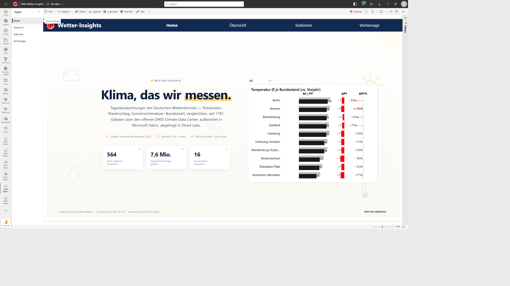

# DWD-Wetter-Insights — Microsoft Fabric End-to-End Demo

> **From open DWD weather data to a live Power BI insight — in under 30 minutes, no API token required.**

An end-to-end Microsoft Fabric demo that loads German weather observations and forecasts from the [Deutscher Wetterdienst (DWD) Climate Data Center](https://opendata.dwd.de/) — via the open-source [`dwdown`](https://pypi.org/project/dwdown/) and [`wetterdienst`](https://pypi.org/project/wetterdienst/) libraries — into a Lakehouse, exposes them as a Direct Lake semantic model, and serves an interactive 4-page Power BI report. Plus a Data Pipeline for daily orchestration and a Notify notebook for success/failure mail-out.

The real point of this demo is the **architecture pattern**, which is reusable for any public-API time-series source:

```
DWD Climate Data Center (open-data, no auth)
   |
   v
Notebook (PySpark + dwdown / wetterdienst)
   |
   v
Lakehouse (Delta, schemas Wetter_dwdown / Wetter_forecast)
   |
   v   Direct Lake (no import, no refresh)
Semantic Model
   |
   v
Power BI Report   +   Daily Pipeline   +   Notify (Graph mail)
```

## What gets deployed

| # | Item | Type | Purpose |
|---|---|---|---|
| 1 | `DemoLakehouse` | Lakehouse (schemas) | Delta storage, schemas `Wetter_dwdown`, `Wetter_forecast` |
| 2 | `DWD-Wetter-Insights Loader` | Notebook | Loads DWD historic + recent daily observations via `dwdown` |
| 3 | `DWD-Wetter-Insights Forecast Loader` | Notebook | Loads DWD Mosmix forecasts via `wetterdienst` |
| 4 | `DWD-Wetter-Insights Refresh SM` | Notebook | Refreshes the Direct Lake semantic model |
| 5 | `DWD-Wetter-Insights Notify` | Notebook | Sends success/failure email via Microsoft Graph |
| 6 | `Wetter-Insights` | SemanticModel | Direct Lake on the Lakehouse (de-DE, Calendar + PY measures) |
| 7 | `DWD Wetter-Insights` | Report | 4-page Power BI report (IBCS variance, Azure Map) |
| 8 | `DWD-Wetter-Insights Daily` | DataPipeline | Loader -> Refresh SM -> Notify (success / failure branches) |

All items are placed in a new workspace folder named `DWD-Wetter-Insights`.

## Data scope

**Observations** (schema `Wetter_dwdown`):
- `beobachtungentag` — daily observations across all German DWD stations (~7.5M rows, 1900–today)
- `stationen` — ~1,400 station master records (geo, height, state)
- Variables: temperature (avg/min/max), precipitation, sunshine duration, wind, snow

**Forecasts** (schema `Wetter_forecast`):
- `vorhersagestunde` — hourly Mosmix forecasts (~48M rows, ~10 days horizon)
- `vorhersageparameter` — parameter dictionary (~114 variables)
- `vorhersagestationen` — Mosmix station master

**Calendar** (schema `dbo`):
- `calendar` — 1900-01-01 .. 2030-12-31 with full date hierarchy

License: [GeoNutzV](https://www.dwd.de/DE/service/copyright/copyright_node.html) — DWD open data is free for commercial use with attribution.

## Report pages

| Page | Screenshot | Highlights |
|---|---|---|
| **Home** | [home.png](./screenshots/home.png) | Bundesland temperature comparison with IBCS PY deltas (Multi-Tier Bar custom visual) |
| **Übersicht** | [uebersicht.png](./screenshots/uebersicht.png) | KPI cards (rows, stations, avg temp, rainfall), time-series, distribution |
| **Stationen** | [stationen.png](./screenshots/stationen.png) | Azure Map of all stations, Top-N table, observations-per-station bar |
| **Vorhersage** | [vorhersage.png](./screenshots/vorhersage.png) | Next-7-day forecast view (uses Mosmix tables) |



## Prerequisites

1. **Microsoft Fabric workspace** on a Fabric / Power BI Premium or Trial capacity.
2. **No API tokens, no registration** — DWD Climate Data Center is fully open.
3. (Optional, for the Notify notebook) the notebook user needs delegated `Mail.Send` permission, which they already have in any normal M365 tenant.

## Install

The fastest path — no local Python, no `az login`, no env vars, no tokens.

1. Open your target Fabric workspace.
2. **New → Import notebook → Upload** → pick [`Install-DWD-Wetter-Insights.ipynb`](./Install-DWD-Wetter-Insights.ipynb).
3. **Run all** — the notebook authenticates via `notebookutils`, auto-detects the workspace, and deploys all 8 items, then triggers the Daily pipeline once.

Direct raw URL of the installer notebook:

```
https://raw.githubusercontent.com/KornAlexander/Fabric-Demos/main/DWD-Wetter-Insights/Install-DWD-Wetter-Insights.ipynb
```

## After install

1. Open the workspace → folder `DWD-Wetter-Insights`.
2. The Daily pipeline has already kicked off (~15–25 min for the initial historic + Mosmix load + SM refresh).
3. Open the **`DWD Wetter-Insights`** report — Direct Lake lights up automatically.
4. **Schedule** the `DWD-Wetter-Insights Daily` pipeline daily at 06:00 (DWD publishes overnight).

## Repository structure

```
DWD-Wetter-Insights/
  Install-DWD-Wetter-Insights.ipynb   # Fabric notebook installer
  README.md                           # this file
  screenshots/
    home.png
    uebersicht.png
    stationen.png
    vorhersage.png
  templates/
    nb_loader.json        # dwdown daily-observations loader (PySpark)
    nb_forecast.json      # wetterdienst Mosmix forecast loader
    nb_refresh_sm.json    # semantic-model refresh notebook
    nb_notify.json        # Graph mail notify notebook
    semantic_model.json   # Direct Lake TMDL (de-DE, Calendar, PY measures)
    report.json           # PBIR (Home + Übersicht + Stationen + Vorhersage)
    pipeline.json         # Load → Refresh → Notify pipeline (with failure branch)
```

All templates use placeholder tokens (`__WORKSPACE_ID__`, `__LAKEHOUSE_ID__`, `__LAKEHOUSE_NAME__`, `__SEMANTICMODEL_ID__`, `__LOADER_NB_ID__`, `__FORECAST_NB_ID__`, `__REFRESH_SM_NB_ID__`, `__NOTIFY_NB_ID__`) which the installer substitutes at deploy time.

## Known issues

- **Vorhersage page shows -273.2 °C cards on first install** — the Mosmix loader currently writes raw Kelvin values for some temperature fields (the sentinel `0 K` = `-273.15 °C`). Patch the temperature columns to subtract 273.15 before writing, or apply the conversion in a measure.

## Cleanup

To remove everything: delete the `DWD-Wetter-Insights` folder from the workspace. All items inside go with it. The lakehouse (`DemoLakehouse`) is shared with other demos and is **not** deleted automatically — drop only the `Wetter_dwdown` and `Wetter_forecast` schemas if you want to free the space.
