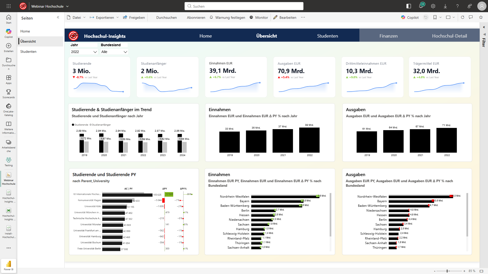
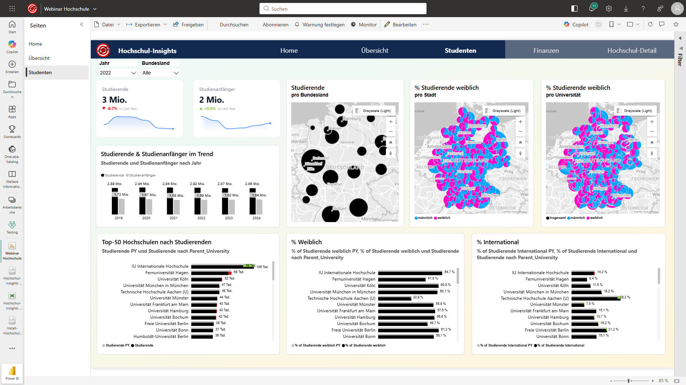
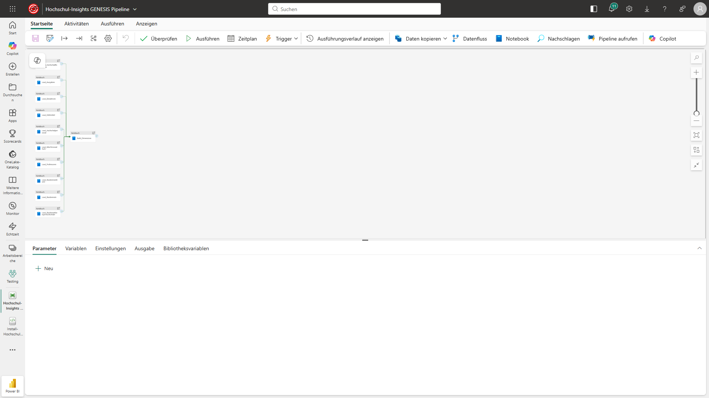
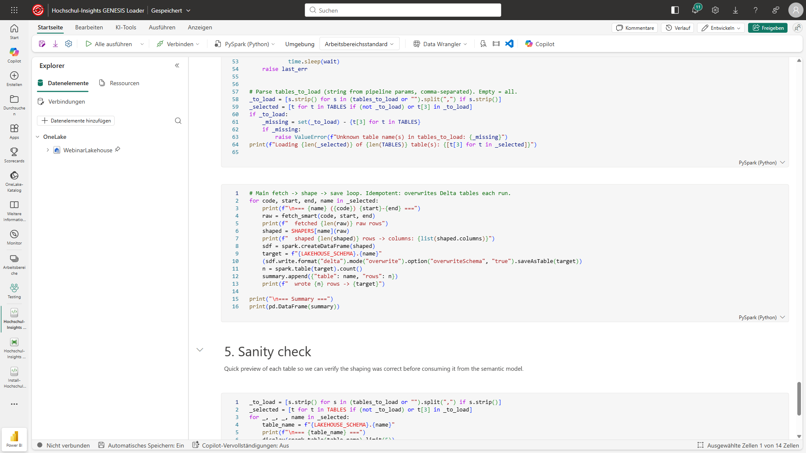

# Hochschul-Insights — Microsoft Fabric End-to-End Demo

> **Vom oeffentlichen DESTATIS-Datensatz zum Live-Power-BI-Insight — in unter 30 Minuten.**

An end-to-end Microsoft Fabric demo that loads German higher-education statistics from the DESTATIS GENESIS REST API into a Lakehouse, exposes them as a Direct Lake semantic model and serves an interactive 8-page Power BI report — plus a Data Pipeline for orchestration and a Data Agent for natural-language Q&A.

The real point of this demo is the **architecture pattern**, which is reusable for any public or customer data source.

## Architecture

<picture>
  <source media="(prefers-color-scheme: dark)" srcset="docs/architecture-dark.svg">
  
</picture>

External sources (DESTATIS GENESIS REST API + Wikidata SPARQL) feed two PySpark notebooks orchestrated by a Data Pipeline. The notebooks write Delta tables into the `Genesis` schema of `WebinarLakehouse`. A Direct Lake Semantic Model (`Hochschule`) sits on top — no import, no refresh — and powers both the `Webinar Hochschule` Power BI report and the optional `Hochschul-Stats-Agent` for natural-language Q&A.

<details>
<summary>Mermaid source (regenerate SVGs at <a href="https://jumpstart.fabric.microsoft.com/tools/diagram-generator">jumpstart.fabric.microsoft.com/tools/diagram-generator</a>)</summary>

```mermaid
graph LR
    GEN[DESTATIS GENESIS REST API]:::U2601
    WIKI[Wikidata SPARQL]:::U2601
    subgraph Fabric:::Workspace
        PIPE[Hochschul-Insights GENESIS Pipeline]:::DataPipeline
        LOADER[Hochschul-Insights GENESIS Loader]:::Notebook
        DIMS[Hochschul-Insights GENESIS Dimensions]:::Notebook
        LH[WebinarLakehouse]:::Lakehouse
        SM[Hochschule]:::SemanticModel
        RPT[Webinar Hochschule]:::Report
        AGENT[Hochschul-Stats-Agent]:::DataAgent
        direction LR
    end
    GEN -.-> LOADER
    WIKI -.-> DIMS
    PIPE ==> LOADER
    PIPE ==> DIMS
    LOADER --> LH
    DIMS --> LH
    LH --> SM
    SM --> RPT
    SM --> AGENT
```

</details>

## What gets deployed

| # | Item | Type | Purpose |
|---|---|---|---|
| 1 | `WebinarLakehouse` | Lakehouse (schemas) | Delta storage, schema `Genesis` |
| 2 | `Hochschul-Insights GENESIS Loader` | Notebook | Loads 10 GENESIS fact tables |
| 3 | `Hochschul-Insights GENESIS Dimensions` | Notebook | Builds 6 dims (incl. Wikidata-enriched Hochschulen) |
| 4 | `Hochschul-Insights GENESIS Pipeline` | DataPipeline | Loader (parallel) -> Dimensions |
| 5 | `Hochschule` | SemanticModel | Direct Lake on the Lakehouse |
| 6 | `Webinar Hochschule` | Report | 8-page Power BI report (IBCS + Azure Map) |
| 7 | `Hochschul-Stats-Agent` | DataAgent | Optional — natural-language Q&A |

All items are placed in a new workspace folder named `Hochschul-Insights`.

## Report preview

The deployed `Webinar Hochschule` report is an 8-page IBCS-styled walk through German higher-education statistics. The first three pages:

**Home — landing page with KPIs and Top-10 university ranking**


**Übersicht — KPI cards plus IBCS comparison charts for Studierende, Einnahmen, Ausgaben across Bundesländer**



**Studenten — Studierenden split by gender, city, and university, including Azure Maps geo visuals**



## Pipeline

`Hochschul-Insights GENESIS Pipeline` runs all 10 fact-table loader notebooks in parallel, then triggers the Dimensions notebook once the facts are in place:



## Loader notebook

`Hochschul-Insights GENESIS Loader` fetches each table from the GENESIS REST API, reshapes it into a tidy Spark DataFrame, and writes Delta to the lakehouse — idempotent, overwrite-each-run:



## Data scope

10 fact tables + 6 dimension tables covering:

- **Studierende & Studienanfaenger** (21311-0001, 21311-0002, 21311-0011)
- **Hochschulpersonal & Professoren** (21341-0001/0002/0003)
- **Finanzen** — Hochschulfinanzen, Ausgaben, Einnahmen, Drittmittel (21371-0010..0013)
- Dimensions: **Bundesland, Hochschulart, Faechergruppe, Geschlecht, Nationalitaet** + **Hochschulen** (with Wikidata geo enrichment)

License: [Datenlizenz Deutschland 2.0](https://www.govdata.de/dl-de/by-2-0) — commercial use OK with attribution.

## Prerequisites

1. **Microsoft Fabric workspace** on a Fabric/Power BI Premium or Trial capacity.
2. **DESTATIS GENESIS token** (free, only needed for *live mode*):
   - Register at [https://www-genesis.destatis.de/](https://www-genesis.destatis.de/genesis/online).
   - Copy your **username** token from your profile page.
   - The free tier is sufficient (the loader only uses synchronous calls).
   - For larger volumes / async jobs, request a Premium token via `genesis-online@destatis.de` (free for institutions).
   - Skip this entirely for *snapshot mode* (bundled CSVs).

## Install: Fabric notebook

This is the fastest path — no local Python, no `az login`, no env vars.

1. Open your target Fabric workspace.
2. **New -> Import notebook -> Upload** -> pick [`Install-Hochschul-Insights.ipynb`](./Install-Hochschul-Insights.ipynb) (or use the raw URL below).
3. Paste your DESTATIS token into the `GENESIS_TOKEN` parameter cell.
4. **Run all** — the notebook authenticates itself via `notebookutils`, auto-detects the workspace, and deploys all 7 items.

Direct raw URL of the installer notebook:

```
https://raw.githubusercontent.com/KornAlexander/Fabric-Demos/main/Hochschul-Insights/Install-Hochschul-Insights.ipynb
```

## After install

1. Open the workspace -> folder `Hochschul-Insights`.
2. Run the pipeline **`Hochschul-Insights GENESIS Pipeline`** once (~5-10 min). It loads the 10 fact tables in parallel, then builds the dimensions.
3. Open the **`Webinar Hochschule`** report — Direct Lake lights up automatically.
4. Schedule the pipeline weekly (DESTATIS updates monthly at most).

## Repository structure

```
Hochschul-Insights/
  Install-Hochschul-Insights.ipynb   # Fabric notebook installer
  Install-Hochschul-Insights.py      # Installer module fetched by the notebook
  README.md                          # this file
  templates/
    loader_notebook.json      # GENESIS REST API loader (PySpark)
    dims_notebook.json        # Hochschulen dim with Wikidata enrichment
    pipeline.json             # 10x parallel notebook runs -> Dimensions
    semantic_model.json       # Direct Lake TMDL model
    report.json               # 8-page PBIR report
    dataagent.json            # Natural-language Q&A agent
```

## Security note

**No tokens are committed to this repo.** The DESTATIS token is supplied at install time and only injected into the notebook payload locally on your machine before being POSTed to the Fabric REST API. For production deployments, store the token in Azure Key Vault and read it via `notebookutils.credentials.getSecret()` in the loader instead.

## Author

Alexander Korn — Solution Engineer Data Platform, Microsoft.
